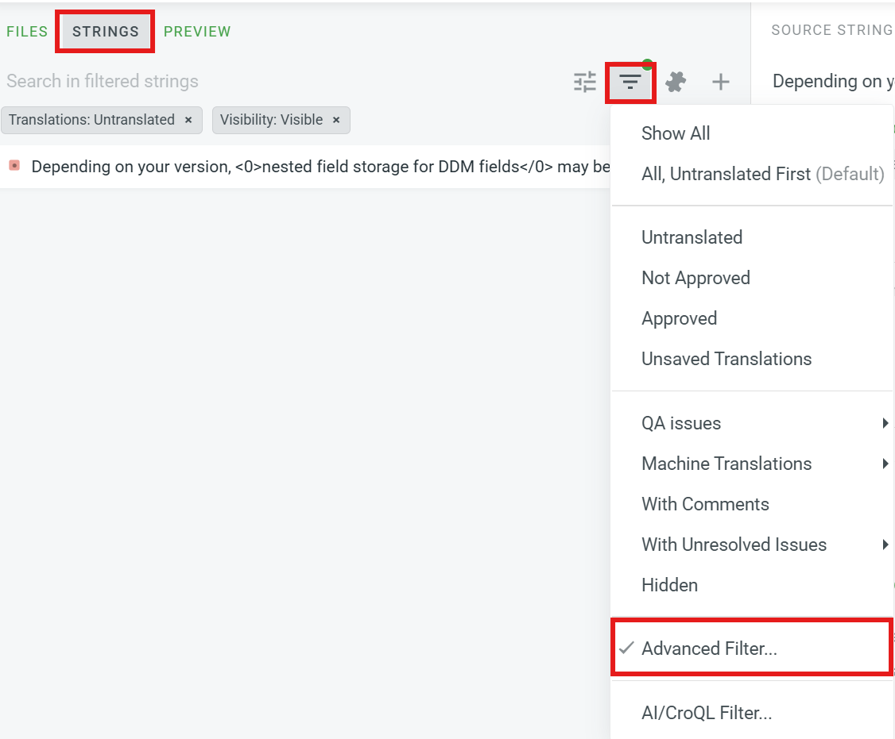
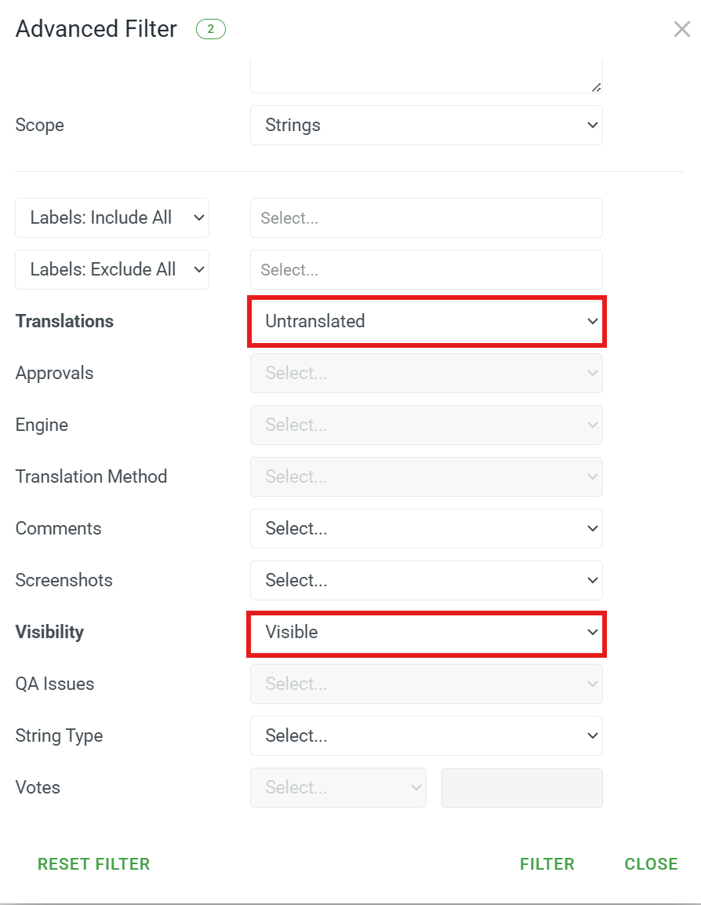

## Script prerequisites

Install `uv` following the instructions at https://docs.astral.sh/uv/#projects

```
uv venv
uv pip install -r requirements.txt
```

## Backup retrieval


## Translation process

### Copy the latest batch to Crowdin

```
./translate_learn.sh copy_learn_to_local
./translate_learn.sh check_outdated_articles
./translate_learn.sh copy_local_to_crowdin
```

### Machine translate the uploaded batch

**Note**: You can access the page with the Auto-Translate button (https://crowdin.com/project/liferay-japan-documentation) or use the links below to directly access the Auto-Translate pages.

1. Perform an initial pass using translation memory
   * Auto-Translate (Translation Memory): https://crowdin.com/project/liferay-japan-documentation#autotranslate=tm
     * Auto-Translation via: Translation Memory
     * Minimum match ratio: Perfect
     * Target languages: Japanese
     * Scope: Untranslated strings
     * Files: learn.liferay.com
   * Wait for completion by clicking on the `queue` link in the pop-up: https://crowdin.com/project/liferay-japan-documentation/tools/pre-translation-queue

2. Perform a second pass using Google Translate
   * Auto-Translate (Machine Translation): https://crowdin.com/project/liferay-japan-documentation#autotranslate=mt
     * Auto-Translation via: Machine Translation
     * Translation engine: Google Translate
     * Target languages: Japanese
     * Scope: Untranslated strings
     * Files: learn.liferay.com
   * Wait for completion by clicking on the `queue` link in the pop-up: https://crowdin.com/project/liferay-japan-documentation/tools/pre-translation-queue

3. Perform a third pass using DeepL Translator:
   * Auto-Translate (Machine Translation): https://crowdin.com/project/liferay-japan-documentation#autotranslate=mt
     * Auto-Translation via: Machine Translation
    * Translation engine: DeepL Translator
    * Target languages: Japanese
    * Scope: Untranslated strings
    * Files: learn.liferay.com
   * Wait for completion by clicking on the `queue` link in the pop-up: https://crowdin.com/project/liferay-japan-documentation/tools/pre-translation-queue

### Manually translate anything that was skipped

Check for the files under the `learn.liferay.com` here:

* https://crowdin.com/project/liferay-japan-documentation/ja

You can install the following user script in order to automatically highlight anything that is not 100% translated.

* https://github.com/holatuwol/liferay-faster-deploy/raw/refs/heads/master/userscripts/crowdin.user.js

In order to speed up the manual translation process, use advanced filters:



This will allow you to limit what's shown in the CrowdIn translation UI to only untranslated strings:



### Sync state between local and learn.liferay.com
```
./translate_learn.sh copy_crowdin_to_local
./translate_learn.sh copy_local_to_learn
./translate_learn.sh copy_learn_to_local
./translate_learn.sh check_outdated_articles
```